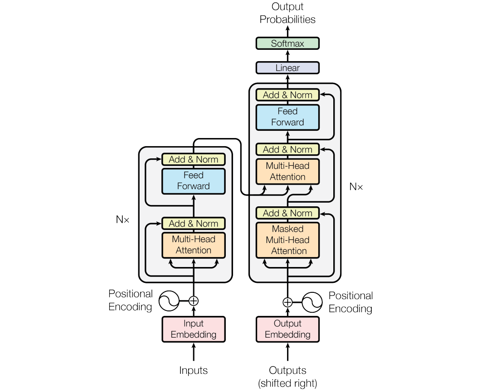
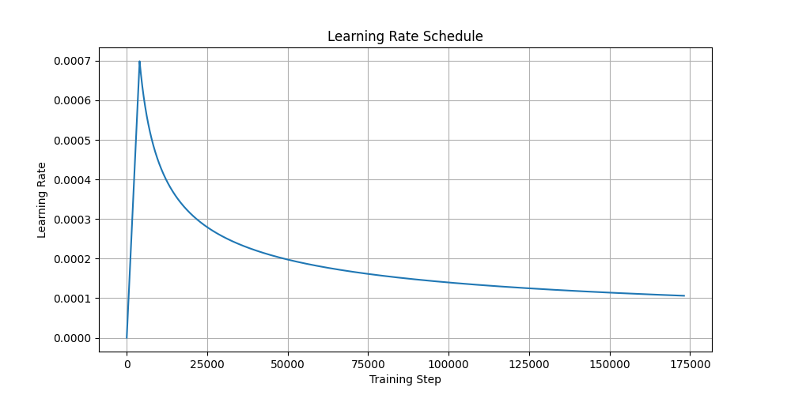
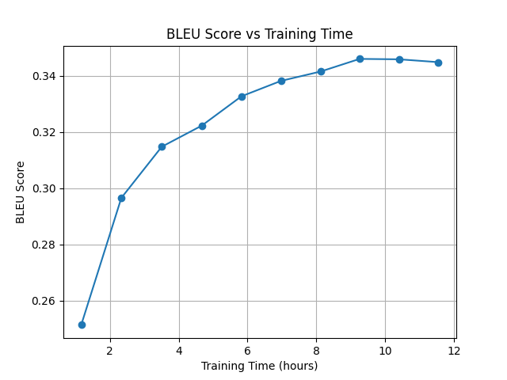

# Attention Is All You Need: A PyTorch Implementation

The Transformer model in "[Attention Is All You Need](https://arxiv.org/abs/1706.03762)" established the foundation for more performant and context-aware sequence transduction by removing the recurrent or convolutional means of previous state-of-the-art models. 
This is mainly due to the Transformer’s ability to process multiple sequences simultaneously. 
Until today, the Transformer model remains the architecture of choice for top-performing large language models, like GPT-4o.

> The official Tensorflow Implementation can be found in: [tensorflow/tensor2tensor](https://github.com/tensorflow/tensor2tensor/blob/master/tensor2tensor/models/transformer.py).

> You can learn more about the Transformer model, particularly the attention mechanism and the underlying intuition, in "[The Illustrated Transformer](https://jalammar.github.io/illustrated-transformer/)."

My [Project Report](report/main.pdf) provides a more detailed description of my implementation, training regime, and results.
It focuses on providing the reader with detailed information about its components and their interplay, as well as my insights and struggles during development and training.
Additionally, it provides an analysis of memory requirements for CPU and GPU training.

# Usage
The packing and dependency management is handled by [Poetry](https://python-poetry.org/).
To install the necessary dependencies, run `poetry install`.

## Data
The model has been trained on the [WMT17](https://www.statmt.org/wmt17/translation-task.html) German-to-English dataset, accessible via [Huggingface](https://huggingface.co/datasets/wmt/wmt17).
The dataset consists of around 4.9 million sentence pairs after filtering out sequences exceeding 64 tokens in length.
Since the model is trained on the High Performace Cluster (HPC) of the Heinrich-Heine-University Düsseldorf without direct internet access, the data needs to be preprocessed beforehand using the `prepare_offline_data.py` script.

## Training
I train the model on a single NVIDIA A100 GPU for 170.000 steps (10 epochs), resulting in roughly 11 hours of training time.
The figure below shows the learning rate schedule with a warmup phase of 4000 steps. 
Notice that I used the [AdamW optimizer](https://arxiv.org/abs/1711.05101), which was not around at the time of publication of the original paper. It has favorable properties over Adam (cf. to section 3.3 of my project report).

## Results
The Transformer model reaches a BLEU score of around 0.34 with a length ratio of 0.99 on the validation.

## Translation Examples

### Example 1
> **Source:** 28-jähriger Koch in San Francisco Mall tot aufgefunden  
> **Reference:** 28-year-old chef found dead at San Francisco mall  
> **Translation:** 28-year-old cook in San Francisco mall **tot found**

---

### Example 2
> **Source:** *ein sprecher des sons & daughters sagte, dass sie über seinen tod schockiert und am boden zerstört seien.*  
> **Reference:** *a spokesperson for sons & daughters said they were shocked and devastated by his death.*  
> **Translation:** *a speaker of sons & daughters said that they were shocked by his death and **destroyed on the ground**.*

